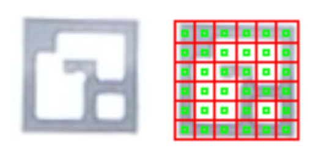
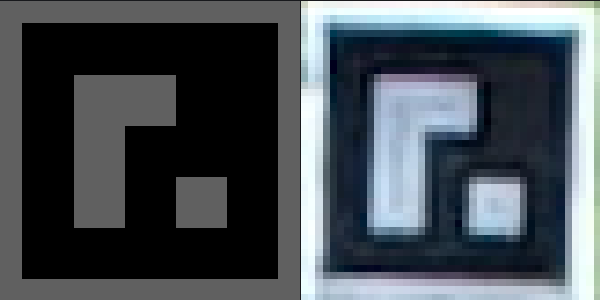
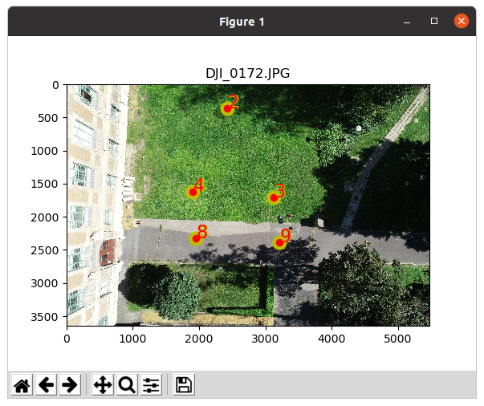

# Find-GCP
Find ArUco markers in digital photos

A paper is available about this project in the Baltic Journal of Modern 
Computing Vol 9. (2021) No.1 
[Automatic Recognition of ArUco Codes in Land Surveying Tasks](https://www.bjmc.lu.lv/fileadmin/user_upload/lu_portal/projekti/bjmc/Contents/9_1_06_Siki.pdf).

[The project page on OpenHub](https://www.openhub.net/p/Find-GCP)

[ArUco markers](http://chev.me/arucogen) are black and white square markers 
which have unique pattern and ID. [OpenCV](https://opencv.org) library has
a modul to find ArUco markers in images (you should pip install 
*opencv-python*, *opencv-contrib-python*, *Pillow (PIL)*, *pil.imagetk*, *numpy* and *matplotlib*).

```pip install opencv-python opencv-contrib-python PIL pil.imagetk numpy matplotlib```

Before taking the photos the different ArUco markers have to be printed in the
suitable size and put on the field. The coordinates of markers have to be
measured by GNSS (GPS), total station or other surveyor's method. We prefer the
3x3 or 4x4 ArUco library, the larger the squares in the marker, the smaller the 
the total marker size can be. You should print markers on gray background to
avoid burt in of white on photos. You can use [gsd_calc](http://www.agt.bme.hu/on_line/gsd_calc/gsd_calc.html)
utitility to estimate
necessary marker size from the sensor parameters and fligth altitude.

The 3x3 or 4x4 ArUco markers on the image should be minimum 20 x 20 pixels to be
detected, the optimal
marker size is 30 x 30 pixels. You should plan the marker size depending on the 
flight altitude and camera parameters. For example 30 x 30 cm markers are enough
for a DJI Phantom 4P flying 50 m above the ground.

This small utility can be used together with photogrammetric programs like Open
Drone Map or WebODM to create the necessary Ground Control Point (GCP) file 
containing image coordinates and projected coordinates of GCPs. 
It has command line interface (CLI) only. There are several parameters:

```
usage: gcp_find.py [-h] [-d DICT] [-o OUTPUT] [-t {ODM,VisualSfM}] [-i INPUT]
                   [-s SEPARATOR] [-v] [--debug | --multi] [-l] [--epsg EPSG]
                   [-a] [--markersize MARKERSIZE] [--markerstyle MARKERSTYLE]
                   [--markerstyle1 MARKERSTYLE1] [--edgecolor EDGECOLOR]
                   [--edgewidth EDGEWIDTH] [--fontsize FONTSIZE]
                   [--fontcolor FONTCOLOR] [--fontcolor1 FONTCOLOR1]
                   [--fontweight FONTWEIGHT] [--fontweight1 FONTWEIGHT1]
                   [--limit LIMIT] [--nez] [-r] [--winmin WINMIN]
                   [--winmax WINMAX] [--winstep WINSTEP] [--thres THRES]
                   [--minrate MINRATE] [--maxrate MAXRATE] [--poly POLY]
                   [--corner CORNER] [--markerdist MARKERDIST]
                   [--borderdist BORDERDIST] [--borderbits BORDERBITS]
                   [--otsu OTSU] [--persp PERSP] [--ignore IGNORE]
                   [--error ERROR] [--correct CORRECT]
                   [--refinement REFINEMENT] [--refwin REFWIN]
                   [--maxiter MAXITER] [--minacc MINACC]
                   [file_names [file_names ...]]

positional arguments:
  file_names            image files to process

optional arguments:
  -h, --help            show this help message and exit
  -d DICT, --dict DICT  marker dictionary id, default=1 (DICT_4X4_100)
  -o OUTPUT, --output OUTPUT
                        name of output GCP list file, default stdout
  -t {ODM,VisualSfM}, --type {ODM,VisualSfM}
                        target program ODM or VisualSfM, default
  -i INPUT, --input INPUT
                        name of input GCP coordinate file, default None
  -s SEPARATOR, --separator SEPARATOR
                        input file separator, default
  -v, --verbose         verbose output to stdout
  --debug               show detected markers on image
  --multi               process images paralel
  -l, --list            output dictionary names and ids and exit
  --epsg EPSG           epsg code for gcp coordinates, default None
  -a, --adjust          adjust colors by built in lookup table
  --markersize MARKERSIZE
                        marker size on debug image, use together with debug
  --markerstyle MARKERSTYLE
                        marker style for point with coordinates, use together
                        with debug
  --markerstyle1 MARKERSTYLE1
                        marker style for point without coordinates, use
                        together with debug
  --edgecolor EDGECOLOR
                        marker edge color, use together with debug
  --edgewidth EDGEWIDTH
                        marker edge width, use together with debug
  --fontsize FONTSIZE   font size on debug image, use together with debug
  --fontcolor FONTCOLOR
                        inner font color on debug image, use together with
                        debug
  --fontcolor1 FONTCOLOR1
                        outer font color on debug image, use together with
                        debug
  --fontweight FONTWEIGHT
                        inner font weight on debug image, use together with
                        debug
  --fontweight1 FONTWEIGHT1
                        outer font weight on debug image, use together with
                        debug
  --limit LIMIT         limit the number of records in the output for a unique
                        id
  --nez                 set the coordinate order in GCP input to
                        North,East,Elevation (compatible with GCPEditorPro)
  -r, --inverted        detect inverted markers
  --winmin WINMIN       adaptive tresholding window min size, default 3
  --winmax WINMAX       adaptive thresholding window max size, default 23
  --winstep WINSTEP     adaptive thresholding window size step , default 10
  --thres THRES         adaptive threshold constant, default 7.0
  --minrate MINRATE     min marker perimeter rate, default 0.03
  --maxrate MAXRATE     max marker perimeter rate, default 4.0
  --poly POLY           polygonal approx accuracy rate, default 0.03
  --corner CORNER       minimum distance any pair of corners in the same
                        marker, default 0.05
  --markerdist MARKERDIST
                        minimum distance any pair of corners from different
                        markers, default 0.05
  --borderdist BORDERDIST
                        minimum distance any marker corner to image border,
                        default 3
  --borderbits BORDERBITS
                        width of marker border, default 1
  --otsu OTSU           minimum stddev of pixel values, default 5.0
  --persp PERSP         number of pixels per cells, default 4
  --ignore IGNORE       Ignored pixels at cell borders, default 0.13
  --error ERROR         Border bits error rate, default 0.35
  --correct CORRECT     Bit correction rate, default 0.6
  --refinement REFINEMENT
                        Subpixel process method, default 0
  --refwin REFWIN       Window size for subpixel refinement, default 5
  --maxiter MAXITER     Stop criteria for subpixel process, default 30
  --minacc MINACC       Stop criteria for subpixel process, default 0.1

```

List of the available dictionary codes (see --list):

```
0 : DICT_4X4_50
1 : DICT_4X4_100
2 : DICT_4X4_250
3 : DICT_4X4_1000
4 : DICT_5X5_50
5 : DICT_5X5_100
6 : DICT_5X5_250
7 : DICT_5X5_1000
8 : DICT_6X6_50
9 : DICT_6X6_100
10 : DICT_6X6_250
11 : DICT_6X6_1000
12 : DICT_7X7_50
13 : DICT_7X7_100
14 : DICT_7X7_250
15 : DICT_7X7_1000
16 : DICT_ARUCO_ORIGINAL
17 : DICT_APRILTAG_16H5
17 : DICT_APRILTAG_16h5
18 : DICT_APRILTAG_25H9
18 : DICT_APRILTAG_25h9
19 : DICT_APRILTAG_36H10
19 : DICT_APRILTAG_36h10
20 : DICT_APRILTAG_36H11
20 : DICT_APRILTAG_36h11
99 : DICT_3X3_32 custom
```

Parameters from *winmin* to *minacc* are customizable parameters for ArUco
detection and are explaned in the OpenCV 
[Aruco documentation](https://docs.opencv.org/trunk/d5/dae/tutorial_aruco_detection.html).
The two most important parameters are *minrate* and *ignore*. Usually the 
default values of these parameters are not perfect.

*minrate* defines the minimal size of a marker in a relative way. For example if
the larger image size is 5472 pixels and the *minrate* parameter is 0.01, then the
minimal perimeter of an ArUco marker should be 0.01 \* 5472 = 54 pixels, and the
minimal size of the marker side is 54 / 4 = 13 pixels. Smaller marker candidates 
are dropped. Our exprerience is the minimal marker side should be 20-30 pixels
to detect 4x4 markers. Using the special 3x3 markers (see: dict\_gen\_3x3.py)
the size of the marker can be reduced.
So you can calculate marker size in centimetres if you know
the pixel size in centimetres, in case of 30-50 metres flight altitude, it is
1-2 cm (DJI Phantom Pro). You should use 20-40 cm large markers.

*ignore* is also a relative value. It defines the percent of pixels to ignore 
at the border of the elemens of the marker matrix. In strong sunshine the white
areas are burnt on the image. A 0.33 value (33%) is good for burnt images, the
green squares on Fig.1. below will be used to detect black/white elements.
There is an other solution to reduce the
burnt effect, use grey paper to print the aruco codes. The second figure below
shows the original black/grey marker and the marker on the image. Thanks to the
adaptive thresholding in the ArUco module, grey and black can be separated.
*adjust* can also be used to reduce the effect of white burnt in.



Fig.1. Burnt in effect and the --ignore



Fig.2. Burnt in effect reduced by black/grey marker. Original marker left, marker on image right.

Sample imput file for GCP coordinates (pointID easting northing elevation):

```
0 650544.828 237514.298 104.215
1 650552.086 237521.011 104.129
2 650546.305 237521.605 104.217
3 650534.729 237526.552 104.267
4 650542.850 237532.382 104.165
5 650553.513 237514.344 104.169
6 650552.275 237505.909 104.196
```

See our publication in Baltic Journal of Modern Computing:
[Automatic Recognition of ArUco Codes in Land Surveying Tasks](https://www.bjmc.lu.lv/fileadmin/user_upload/lu_portal/projekti/bjmc/Contents/9_1_06_Siki.pdf)

## Utilities

There are some small utilities in this repo, too.

### exif\_pos.py

This small program lists GPS position from exif information of images to the
standard output. You can redirect standard output to a file and load it for
example into QGIS as delimited text layer to show image positions.

```
Usage: ./exif_pos.py image_file(s)

```
 
Sample output of the program:

```
./exif_pos.py *.JPG
DJI_0021.JPG,19.120939,47.683572,203.86
DJI_0022.JPG,19.120958,47.683647,203.86
DJI_0023.JPG,19.120985,47.683718,203.86
DJI_0024.JPG,19.121020,47.683821,203.76
DJI_0025.JPG,19.121042,47.683890,203.76
DJI_0026.JPG,19.121080,47.683997,203.76
DJI_0038.JPG,19.120905,47.684089,203.76
DJI_0039.JPG,19.120872,47.683985,203.76
DJI_0040.JPG,19.120846,47.683917,203.76
DJI_0041.JPG,19.120786,47.683741,203.86
DJI_0042.JPG,19.120762,47.683671,203.86
DJI_0043.JPG,19.120725,47.683566,203.86
```

### dict\_gen\_3x3.py

It generates 32 custom 3x3 ArUco dictionary markers in dict\_3x3 subdirectory
(png files). File names are 3x3_id.png, where *id* is the ordinal number of
the marker.

### aruco\_make.py

It generates aruco marker images of different standard dictionaries for printing.

```
usage: aruco_make.py [-h] [-d DICT] [-s START] [-e END] [-v]

optional arguments:
  -h, --help            show this help message and exit
  -d DICT, --dict DICT  marker dictionary id (use 99 for 3x3 markers),
                        default= 1 (DICT_4X4_100)
  -s START, --start START
                        first marker to generate, default= 0
  -e END, --end END     last marker to generate, default= -1
  -v, --view            show marker on monitor
  -g, --gray            generate black/gray marker
  --value VALUE         shade of background use with --gray, default=95
  -p PAD, --pad PAD     border width around marker in inches, default= 0.5
```

### gcp\_check.py

It helps the visual check of the found GCPs by gcp\_find.py.

```
usage: gcp_check.py [-h] [--command COMMAND] [--path PATH] [-s SEPARATOR]
                    [--markersize MARKERSIZE] [--markerstyle MARKERSTYLE]
                    [--edgecolor EDGECOLOR] [--edgewidth EDGEWIDTH]
                    [--fontsize FONTSIZE] [--fontcolor FONTCOLOR]
                    [--fontcolor1 FONTCOLOR1] [--fontweight FONTWEIGHT]
                    [--fontweight1 FONTWEIGHT1]
                    file_name

positional arguments:
  file_name             GCP file to process

optional arguments:
  -h, --help            show this help message and exit
  --command COMMAND     command all/ID show all images/images with GCP ID
  --path PATH           input path for images
  -s SEPARATOR, --separator SEPARATOR
                        input file separator, default
  --markersize MARKERSIZE
                        marker size on image, default 10
  --markerstyle MARKERSTYLE
                        marker style for GCPs, default "ro"
  --edgecolor EDGECOLOR
                        marker edge color, default y
  --edgewidth EDGEWIDTH
                        marker edge width, default 3
  --fontsize FONTSIZE   font size on image, default 16
  --fontcolor FONTCOLOR
                        inner font color on image, default r
  --fontcolor1 FONTCOLOR1
                        outer font color on image, default y
  --fontweight FONTWEIGHT
                        inner font weight on image, default normal
  --fontweight1 FONTWEIGHT1
                        outer font weight on image, default bold
```



Figure 3 Marked GCPs

### gsd\_cal

gsd\_calc is a simple web application written in JavaScript using jQuery to
estimate the Ground Sample Distance (GSD) and the ArUco markes size depending on
the sensor data and flight altitude.

There is a small database (realy a JSON file) with the parameters of some 
cameras. There are three obligatory and two optional parameters in it.

-**focal** focal length of the camera in mm
-**iheight** image height in pixels (optional)
-**iwidth** image width in pixels
-**sheight** sensor width in mm
-**swidth** sensor height in mm (optional)

It is available on line [here](http://www.agt.bme.hu/on_line/gsd_calc/gsd_calc.html).

# Samples

Images used in the samples are available in the *samples* directory.
Please share with us your samples using *gcp_find*.

## Sample 1

Find ArUco markers in an image and output marker IDs and image coordinates of
marker centers.

```
./gcp_find.py samples/markers.png

16 502 342 markers.png
15 328 342 markers.png
14 152 342 markers.png
13 502 142 markers.png
12 328 142 markers.png
11 152 142 markers.png
```

## Sample 2

We have 3 images made by DJI Phantom 4 Pro.
Coordinates of GCPs were measured by GNSS and stored in
[A3.txt](samples/A3.txt) file. The 3x3 ArUco markers were used
The next command will generate the necessary text file for ODM.

```
./gcp_find.py -v -t ODM -i samples/A3.txt --epsg 23700 -o samples/gcp_list.txt --minrate 0.01 --ignore 0.33 -d 99 samples/DJI_017[234].JPG

processing samples/DJI_0172.JPG
  5 GCP markers found
processing samples/DJI_0173.JPG
  5 GCP markers found
processing samples/DJI_0174.JPG
  7 GCP markers found
GCP9: on 3 images ['samples/DJI_0172.JPG', 'samples/DJI_0173.JPG', 'samples/DJI_0174.JPG']
GCP8: on 3 images ['samples/DJI_0172.JPG', 'samples/DJI_0173.JPG', 'samples/DJI_0174.JPG']
GCP3: on 3 images ['samples/DJI_0172.JPG', 'samples/DJI_0173.JPG', 'samples/DJI_0174.JPG']
GCP4: on 3 images ['samples/DJI_0172.JPG', 'samples/DJI_0173.JPG', 'samples/DJI_0174.JPG']
GCP2: on 3 images ['samples/DJI_0172.JPG', 'samples/DJI_0173.JPG', 'samples/DJI_0174.JPG']
GCP1: on 1 images ['samples/DJI_0174.JPG']
GCP0: on 1 images ['samples/DJI_0174.JPG']
```

The gcp_list.txt output file which is ready for use with ODM or WebODM.
Copy the gcp_list.txt into your images directory using ODM and add the

```
    --gcp ./images/gcp_list.txt
```

switch to your ODM command.

The gcp_list.txt file should look like:

```
EPSG:2370
650530.705 237530.488 104.066 3206 2391 DJI_0172.JPG 9
650538.926 237536.529 104.113 1952 2323 DJI_0172.JPG 8
650534.729 237526.552 104.267 3124 1703 DJI_0172.JPG 3
650542.850 237532.382 104.165 1908 1622 DJI_0172.JPG 4
650546.305 237521.605 104.217 2419 368 DJI_0172.JPG 2
650530.705 237530.488 104.066 3172 2413 DJI_0173.JPG 9
650538.926 237536.529 104.113 1921 2343 DJI_0173.JPG 8
650534.729 237526.552 104.267 3091 1727 DJI_0173.JPG 3
650542.850 237532.382 104.165 1880 1644 DJI_0173.JPG 4
650546.305 237521.605 104.217 2393 396 DJI_0173.JPG 2
650530.705 237530.488 104.066 3535 2892 DJI_0174.JPG 9
650538.926 237536.529 104.113 2287 2838 DJI_0174.JPG 8
650534.729 237526.552 104.267 3444 2206 DJI_0174.JPG 3
650542.850 237532.382 104.165 2236 2136 DJI_0174.JPG 4
650546.305 237521.605 104.217 2725 879 DJI_0174.JPG 2
650552.086 237521.011 104.129 2239 403 DJI_0174.JPG 1
650544.828 237514.298 104.215 3408 322 DJI_0174.JPG 0
```

## Sample 3

Photos (DJI0087.jpg and DJI0088.jpg) made by a DJI Phantom 4 Pro.
There are three 4x4 GCPs (id=3, id=4, id=5) on image DJI\_0087.jpg and five
(id=0, id=3, id=4, id=5, id=6) on image DJI\_0088.jpg.

```
python3 gcp_find.py --minrate 0.01 samples/bme/DJI_008[78].jpg

5 2832 1845 DJI_0087.jpg
3 2472 731 DJI_0087.jpg
5 3024 3556 DJI_0088.jpg
3 2654 2458 DJI_0088.jpg
0 2448 1315 DJI_0088.jpg
6 3094 1299 DJI_0088.jpg
```

Marker 4 was not detected.

## Sample 4

Photos (DJI\_0180.jpg and DJI\_0181.jpg) made by DJI Phantom 4 Pro, flying
alttitude 50 m.
There are eight 3x3 black/grey GCPs on image DJI\_0180.png and ten on 
DJI\_0181.png.

```
python3 gcp_find.py -d 99 --minrate 0.01 --ignore 0.33 samples/bme/DJI_018[01].jpg 
3 3458 3251 DJI_0180.jpg
4 2700 3229 DJI_0180.jpg
2 2981 2414 DJI_0180.jpg
1 2663 2114 DJI_0180.jpg
7 2644 1038 DJI_0180.jpg
0 3401 2042 DJI_0180.jpg
5 2879 1655 DJI_0180.jpg
6 3328 1214 DJI_0180.jpg
9 3671 2746 DJI_0181.jpg
8 2897 2733 DJI_0181.jpg
3 3602 2322 DJI_0181.jpg
4 2850 2299 DJI_0181.jpg
2 3128 1502 DJI_0181.jpg
1 2812 1207 DJI_0181.jpg
0 3545 1138 DJI_0181.jpg
7 2792 152 DJI_0181.jpg
5 3026 758 DJI_0181.jpg
6 3471 327 DJI_0181.jpg
```

All markers found.
