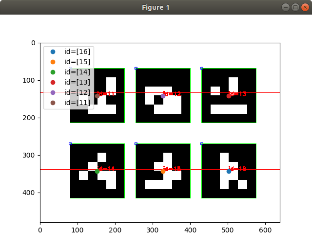
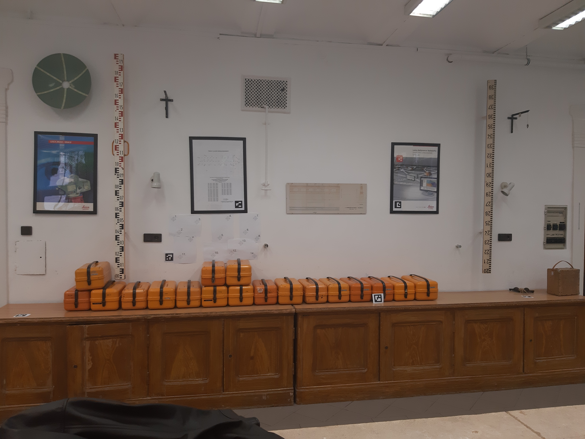
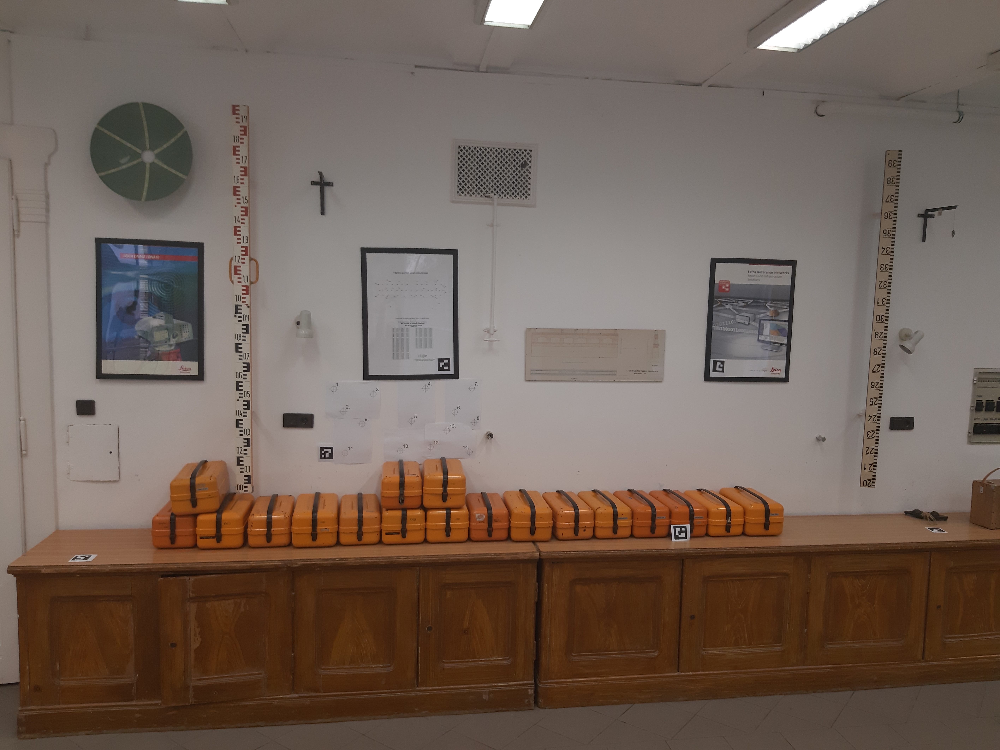

# Find-GCP
Find ArUco markers in digital photos

[ArUco markers](http://chev.me/arucogen) are black and white square marker which have unique pattern and ID. [OpenCV](https://opencv.org) library has a modul to find ArUco markers in images.

Before taking the photos the diffrent ArUco markers have to be printed in the suitable size and put on the field. The coordinates of markers have to be measured by GNSS (GPS) or total station. we prefer the 4x4 ArUco library and those markers where there is a corner at the center of the marker (easy to center your GPS or prism on the field). For example marker with ID 16 is not suitable for this condition, see Figure 1.

This small utility can be used together with photogrammetric programs like Open Drone Map or WebODM to create the necessary Ground Control Point (GCP) file containing image coordinates and projected coordinates of GCPs. It has command line interface (CLI) only.

```
usage: gcp_find.py [-h] [-d DICT] [-o OUTPUT] [-i INPUT] [-s SEPARATOR] [-v]
                   [-l]
                   [file_names [file_names ...]]

positional arguments:
  file_names            image files to process

optional arguments:
  -h, --help            show this help message and exit
  -d DICT, --dict DICT  marker dictionary id, default=1 (DICT_4X4_100)
  -o OUTPUT, --output OUTPUT
                        name of output GCP list file, default stdout
  -i INPUT, --input INPUT
                        name of input GCP coordinate file, default None
  -s SEPARATOR, --separator SEPARATOR
                        input file separator, default space
  -v, --verbose         verbose output to stdout
  -l, --list            output dictionary names and ids and exit
```

## Sample 1

Find ArUco markers in an image and output marker IDs and image coordinates of marker centers.

```
python3 gcp_find.py samples/markers.png

16 502 342 markers.png
15 327 342 markers.png
14 152 342 markers.png
13 502 141 markers.png
12 327 141 markers.png
11 152 141 markers.png
```


## Sample 2

Coordinates of GCPs were measured by total station and stored in [aruco.txt](samples/aruco.txt) file. This GCPs should be used in ODM or WebODM. The next command will generate the necessary text file for ODM.

 

```
python3 gcp\_find.py -v -i samples/aruco.txt -o test.txt samples/2019\*.jpg
Loading GCP coordinates from samples/aruco.txt
processing samples/20191029\_110429.jpg
  5 GCP markers found
processing samples/20191029\_110437.jpg
  6 GCP markers found
GCP6: on 2 images ['samples/20191029\_110429.jpg', 'samples/20191029\_110437.jpg']
GCP5: on 2 images ['samples/20191029\_110429.jpg', 'samples/20191029\_110437.jpg']
GCP4: on 2 images ['samples/20191029\_110429.jpg', 'samples/20191029\_110437.jpg']
GCP1: on 2 images ['samples/20191029\_110429.jpg', 'samples/20191029\_110437.jpg']
GCP3: on 2 images ['samples/20191029\_110429.jpg', 'samples/20191029\_110437.jpg']
GCP2: on 1 images ['samples/20191029\_110437.jpg']
```
The test.txt output file
```
1.041 3.712 -0.560 205 3050 20191029\_110429.jpg
4.119 3.764 -0.518 3658 2886 20191029\_110429.jpg
2.173 4.202 -0.153 1639 2487 20191029\_110429.jpg
4.482 4.201 0.370 3851 1981 20191029\_110429.jpg
2.822 4.201 0.359 2310 1977 20191029\_110429.jpg
4.482 4.201 0.370 4069 2075 20191029\_110437.jpg
2.822 4.201 0.359 2514 2064 20191029\_110437.jpg
1.041 3.712 -0.560 461 3159 20191029\_110437.jpg
5.758 3.859 -0.557 5301 3000 20191029\_110437.jpg
4.119 3.764 -0.518 3852 3017 20191029\_110437.jpg
2.173 4.202 -0.153 1847 2565 20191029\_110437.jpg
```

Note: You have to add [projection parameters](https://docs.opendronemap.org/tutorials.html#ground-control-points) at the beginning of the file to use it with ODM or WebODM.

## Sample 3

Photos (DJI0086.jpg and DJI0087.jpg) made by a DJI Phantom 4.

```
python3 gcp\_find.py samples/bme/DJI\_008[56].jpg

5 2607 3247 DJI\_0086.JPG
6 3370 1185 DJI\_0086.JPG
3 2609 2116 DJI\_0086.JPG
5 2831 1844 DJI\_0087.JPG
4 1962 1764 DJI\_0087.JPG
3 2471 731 DJI\_0087.JPG
17 525 1225 DJI\_0087.JPG


